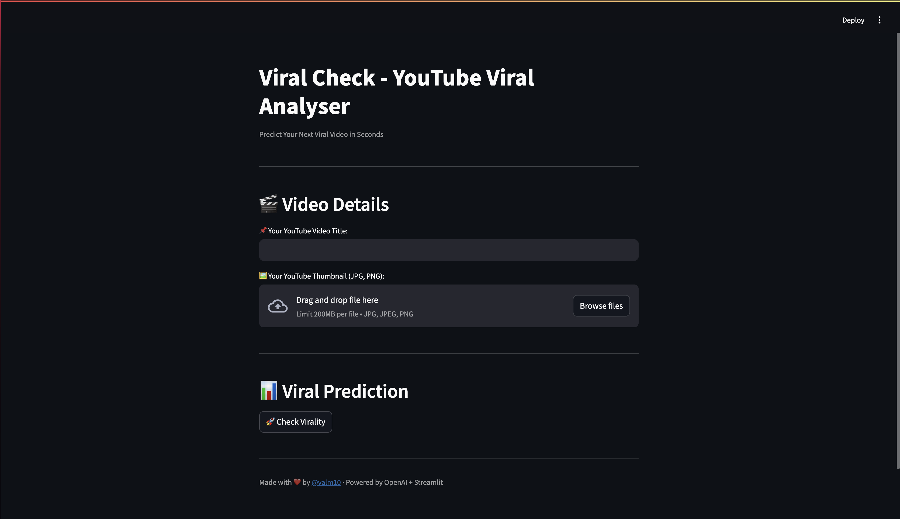

# ViralCheck 

Predict your next viral YouTube video — with AI-powered insights.

---

## What It Does

- Upload a thumbnail
- Input a YouTube title
- Get instant:
  - Virality score
  - Title enhancement (via GPT)
  - Thumbnail ratio validation
  - Mock data for top-performing videos
 
## 🖼 App Preview



---

## Built With

- [Streamlit](https://streamlit.io/)
- [OpenAI API](https://platform.openai.com/)
- Python 3.9+

---

## How to Run Locally

```bash
git clone https://github.com/valm10/viralcheck.git
cd viralcheck
python3 -m venv venv
source venv/bin/activate
pip install -r requirements.txt
